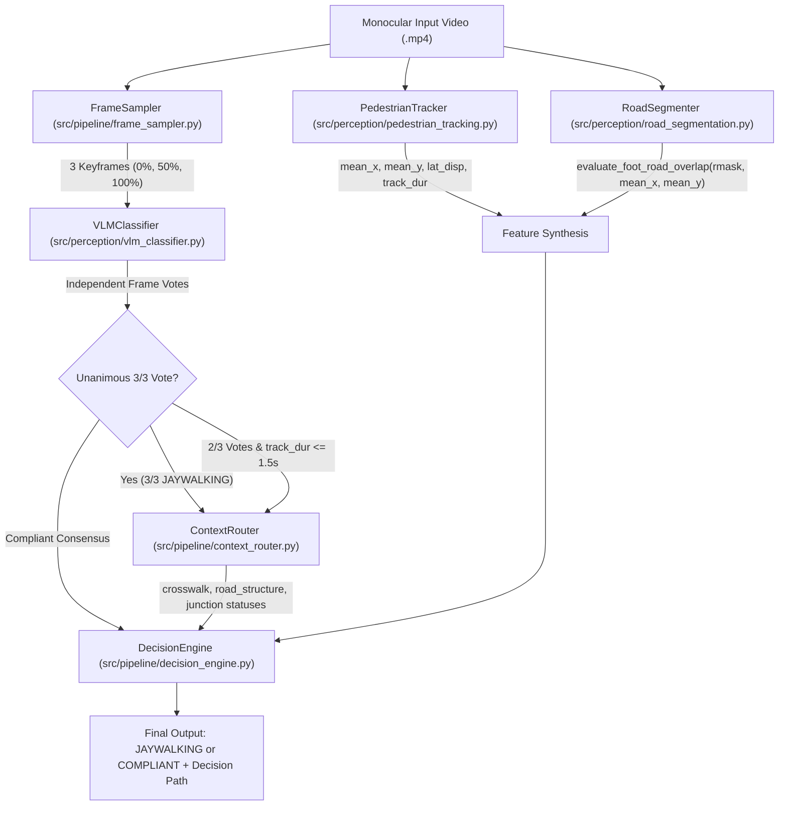

# Crowd Jaywalking Detection

[](LICENSE)
[](.python-version)
[](https://github.com/astral-sh/uv)
[](https://github.com/crowd-dataset/crowd-jaywalking/actions/workflows/linter.yml)

An end-to-end multimodal computer vision framework for detecting pedestrian jaywalking from monocular urban driving video sequences.

The system combines:
- **Vision-Language Reasoning:** Single-frame zero-shot classification and wide-scene context verification using **Qwen2.5-VL-7B** (via local Ollama).
- **Pedestrian Tracking & Pose Extraction:** Multi-object tracking and kinematic lateral displacement measurement via **YOLO26x-Pose** and **BoT-SORT**.
- **Dense Semantic Road Segmentation:** Drivable road surface extraction and foot-road contact ratio evaluation via **SegFormer-B0** (fine-tuned on Cityscapes).
- **Context-Aware Visual Verification:** Targeted visual queries verifying marked crosswalks, public roadways vs. private enclosed parking aprons, and legal intersection junction crossings.
- **Deterministic Multimodal Decision Synthesis:** The frozen **Exp 57 Refined Context Synergy Architecture** executing hierarchical decision rules.

---

## 1. Verified Benchmark Results

The benchmark protocol establishes strict segregation: all system development and threshold calibration were conducted exclusively on the 69-video development set. The 30-video locked test set was evaluated strictly once after freezing the architecture, without post-hoc tuning.

| Benchmark Split | Videos | Accuracy | Precision | Recall | Specificity | F1 Score | TP | TN | FP | FN |
|---|---:|---:|---:|---:|---:|---:|---:|---:|---:|---:|
| **Development Set (Exp 57)** | 69 | **92.75%** | 83.33% | 100.00% | 88.64% | 90.91% | 25 | 39 | 5 | 0 |
| **Locked Unseen Test Set (Exp 58)** | 30 | **83.33%** | 75.00% | 81.82% | 84.21% | 78.26% | 9 | 16 | 3 | 2 |
| **Combined JAAD Labeled Set** | 99 | **89.90%** | 80.95% | 94.44% | 87.30% | 87.18% | 34 | 55 | 8 | 2 |

> **Key Generalization Finding:** The frozen pipeline achieves **83.33% Accuracy** on the completely unseen 30-video locked test partition, maintaining balanced recall (81.82%) and specificity (84.21%) under real-world visual variations.

---

## 2. System Architecture & Pipeline


```mermaid
flowchart TD
    Video["Monocular Input Video (.mp4)"] --> Sampler["FrameSampler (src/pipeline/frame_sampler.py)"]
    Video --> Tracker["PedestrianTracker (src/perception/pedestrian_tracking.py)"]
    Video --> Segmenter["RoadSegmenter (src/perception/road_segmentation.py)"]

    Sampler -->|"3 Keyframes (0%, 50%, 100%)"| VLM["VLMClassifier (src/perception/vlm_classifier.py)"]
    VLM -->|"Independent Frame Votes"| Votes{"Unanimous 3/3 Vote?"}

    Tracker -->|"mean_x, mean_y, lat_disp, track_dur"| Fusion["Feature Synthesis"]
    Segmenter -->|"evaluate_foot_road_overlap(rmask, mean_x, mean_y)"| Fusion

    Votes -->|"Yes (3/3 JAYWALKING)"| Router["ContextRouter (src/pipeline/context_router.py)"]
    Votes -->|"2/3 Votes & track_dur <= 1.5s"| Router
    Votes -->|"Compliant Consensus"| Engine["DecisionEngine (src/pipeline/decision_engine.py)"]

    Router -->|"crosswalk, road_structure, junction statuses"| Engine
    Fusion --> Engine

    Engine --> Verdict["Final Output: JAYWALKING or COMPLIANT + Decision Path"]
```

### End-to-End Execution Sequence ([`src/pipeline/jaywalking_pipeline.py`](src/pipeline/jaywalking_pipeline.py))

1. **Multi-Temporal Sampling:** [`FrameSampler`](src/pipeline/frame_sampler.py) extracts 3 chronological keyframes ($0\%, 50\%, 100\%$) across video duration and 3 intermediate timestamp frames ($25\%, 50\%, 75\%$).
2. **Visual Classification Consensus:** [`VLMClassifier`](src/perception/vlm_classifier.py) queries Qwen2.5-VL-7B on each keyframe independently to collect 3 discrete votes.
3. **Pedestrian Kinematic Tracking:** [`PedestrianTracker`](src/perception/pedestrian_tracking.py) runs YOLO26x-Pose and BoT-SORT across all video frames to extract lateral displacement ($\Delta x = |x_{\text{end}} - x_{\text{start}}|$), average horizontal position ($\bar{x}$), base ground contact position ($\bar{y}$), and active track duration ($T_{\text{track}}$).
4. **Semantic Road Segmentation:** [`RoadSegmenter`](src/perception/road_segmentation.py) uses SegFormer-B0 to segment drivable road masks and evaluates foot-road contact ratio within a 24px radius at $(\bar{x}, \bar{y})$.
5. **Context Verification Gating:** When candidate crossings are indicated, [`ContextRouter`](src/pipeline/context_router.py) queries 3 specialized visual prompts on the wide uncropped midpoint frame:
   - **Crosswalk Verifier:** Checks for white zebra stripes and marked crosswalks (`LEGAL_CROSSWALK` vs. `NO_CROSSWALK`).
   - **Road Structure Verifier:** Differentiates public roadways from enclosed private garages and parking aprons (`PUBLIC_STREET` vs. `PRIVATE_ENCLOSED`).
   - **Junction Verifier:** Checks for legal crossings at intersection corners (`LEGAL_JUNCTION_CROSSING` vs. `UNREGULATED_MIDBLOCK`).
6. **Hierarchical Decision Synthesis:** [`DecisionEngine`](src/pipeline/decision_engine.py) evaluates the frozen Exp 57 decision tree:
   - *Rule 1 (Driveway Apron Filter):* If unanimous VLM, $\bar{y} > 0.84$, $T_{\text{track}} > 6.0\text{s}$, and `road_overlap` $< 0.30$ $\implies$ `COMPLIANT`.
   - *Rule 2 (Marked Crosswalk):* If unanimous VLM and `crosswalk_status` == `LEGAL_CROSSWALK` $\implies$ `COMPLIANT`.
   - *Rule 3 (Intersection Junction):* If unanimous VLM, `junction_status` == `LEGAL_JUNCTION_CROSSING`, `road_structure_status` == `PUBLIC_STREET`, and $\Delta x \ge 0.70$ $\implies$ `COMPLIANT`.
   - *Rule 4 (Enclosed Private Space):* If unanimous VLM, `road_structure_status` == `PRIVATE_ENCLOSED`, and $\bar{y} > 0.82$ $\implies$ `COMPLIANT`.
   - *Rule 5 (Confirmed Public Roadway):* Unanimous VLM on public street $\implies$ `JAYWALKING`.
   - *Fast-Crossing Dash Fallback:* If 2/3 votes, $T_{\text{track}} \le 1.5\text{s}$, $\Delta x \ge 0.15$, and `crosswalk_status` == `NO_CROSSWALK` $\implies$ `JAYWALKING`.
   - *Default:* `COMPLIANT`.

---

## 3. Repository Structure

```text
crowd-jaywalking/
├── .github/
│   ├── linters/
│   │   ├── .flake8                 # Flake8 style configuration (max-line-length = 119)
│   │   ├── .jscpd.json             # Copy/paste detection threshold configuration
│   │   ├── .python-lint            # Python linter line-length specification
│   │   └── .yamllint               # YAML formatting and document rules
│   └── workflows/
│       ├── .mypy.ini               # Mypy type-checking configuration
│       ├── issue-branch.yml        # Automatic branch creation workflow
│       └── linter.yml              # GitHub Actions Super-Linter CI workflow
│
├── configs/
│   └── botsort_custom.yaml         # BoT-SORT tracker configuration (ReID, GMC, thresholds)
│
├── datasets/
│   └── manifests/
│       ├── development_manifest.csv # Ground-truth labels & metadata for 69 dev videos
│       └── locked_test_manifest.csv # Ground-truth labels & metadata for 30 locked test videos
│
├── docs/
│   ├── ARCHITECTURE.md             # Detailed engineering specification of the production pipeline
│   ├── BENCHMARK_PROTOCOL.md       # Dataset stratification, checksums, and evaluation rules
│   └── PROJECT_REPORT.md           # Research evolution, experiment milestones, and failure analysis
│
├── results/
│   ├── development/                # Exp 57 benchmark results, detailed JSON, and transitions
│   └── locked_test/                # Exp 58 locked test results, confusion matrix, and audit log
│
├── scripts/
│   ├── evaluate.py                 # Benchmark evaluation runner (--split development | locked_test)
│   └── run_inference.py            # Single-video inference CLI (--video PATH [--output OUT.json])
│
├── src/
│   ├── perception/
│   │   ├── __init__.py             # Exports PedestrianTracker, RoadSegmenter, VLMClassifier
│   │   ├── pedestrian_tracking.py  # YOLO26x-Pose + BoT-SORT kinematics and mean_x/mean_y extraction
│   │   ├── road_segmentation.py    # SegFormer-B0 Cityscapes drivable road segmentation
│   │   └── vlm_classifier.py       # Qwen2.5-VL-7B Ollama client & verification prompts
│   │
│   ├── pipeline/
│   │   ├── __init__.py             # Exports JaywalkingPipeline, FrameSampler, DecisionEngine, ContextRouter
│   │   ├── context_router.py       # Wide-scene crosswalk, roadway, and junction verifiers
│   │   ├── decision_engine.py      # Frozen Exp 57 rule-based multimodal decision logic
│   │   ├── frame_sampler.py        # Equidistant keyframe & fractional timestamp extractor
│   │   └── jaywalking_pipeline.py  # Unified 6-stage end-to-end detection orchestrator
│   │
│   └── utils/
│       ├── __init__.py             # Exports utility functions
│       ├── metrics.py              # Classification metrics calculation (Acc, Prec, Rec, Spec, F1)
│       ├── plotting.py             # Plotly multi-format figure exporter (HTML, PNG, PDF, SVG)
│       └── video_utils.py          # Video stream decoding and base64 JPEG encoding
│
├── tests/
│   ├── test_pipeline.py            # Unit tests for decision rules, metrics, prompts, tracking
│   └── test_plotting.py            # Unit tests for Plotly multi-format static/vector exports
│
├── common.py                       # Configuration & path management utilities
├── custom_logger.py                # Standardized custom logger with brace formatting
├── default.config                  # Baseline configuration template (JSON)
├── default.secret                  # Baseline credential template (JSON)
├── LICENSE                         # MIT License
├── logmod.py                       # Global logging handlers setup
├── pyproject.toml                  # Project metadata, dependencies, and tool settings
├── .python-version                 # Pinned Python version (3.10)
├── RESEARCH_LOG.md                 # Full chronological research history and experiment log (Exp 1–60)
├── README.md                       # Main documentation
└── uv.lock                         # Deterministic dependency lockfile
```

---

## 4. Supplementary Documentation & Further Reading

- [**`docs/ARCHITECTURE.md`**](docs/ARCHITECTURE.md): Comprehensive system design specification detailing each perceptual component, tensor dimensions, and reasoning logic.
- [**`docs/BENCHMARK_PROTOCOL.md`**](docs/BENCHMARK_PROTOCOL.md): Rigorous dataset stratification protocol, SHA-256 manifest integrity hashes, and zero-leakage evaluation rules.
- [**`docs/PROJECT_REPORT.md`**](docs/PROJECT_REPORT.md): Research summary covering the evolution from baseline prototypes (Exp 42) to the final champion architecture (Exp 57/58).
- [**`RESEARCH_LOG.md`**](RESEARCH_LOG.md): Full chronological lab notebook documenting all 60 empirical experiments, ablations, failure modes, and recovery records.

---

## 5. Installation & Environment Setup

The repository uses [`uv`](https://github.com/astral-sh/uv) for fast, deterministic dependency and environment management.

### 1. Install uv
```bash
curl -LsSf https://astral.sh/uv/install.sh | sh
```

### 2. Clone Repository & Sync Environment
```bash
git clone https://github.com/crowd-dataset/crowd-jaywalking.git
cd crowd-jaywalking

uv sync --all-extras
```
*Note:* The environment uses Python 3.10 as configured in [`.python-version`](.python-version) and [`pyproject.toml`](pyproject.toml).

### 3. Configure `config` and `secret`
The repository uses local `config` and `secret` JSON files (which are git-ignored to prevent credential leaks):

1. **Copy configuration template:**
   ```bash
   cp default.config config
   ```
   *Fields in `config`:* Sets runtime options such as `vlm_model` (`"qwen2.5vl:7b"`), `vlm_api_base` (`"http://localhost:11434"`), `tracking_model_path` (`"yolo26x-pose.pt"`), and default video directories.

2. **Copy secret template:**
   ```bash
   cp default.secret secret
   ```
   *Fields in `secret`:* Contains placeholder keys (`"ollama_api_key"`, `"huggingface_token"`, `"github_token"`). For local Ollama inference, leave values as empty strings `""` unless your server requires authentication.

### 4. Start Local Ollama VLM Service
Ensure the local Ollama daemon is running with the vision-language model:
```bash
ollama run qwen2.5vl:7b
```

---

## 6. Tracker Configuration ([`configs/botsort_custom.yaml`](configs/botsort_custom.yaml))

The pedestrian tracker loads hyperparameter settings from [`configs/botsort_custom.yaml`](configs/botsort_custom.yaml):

```yaml
tracker_type: botsort
with_reid: true
gmc_method: sparseOptFlow
appearance_thresh: 0.25
match_thresh: 0.6
new_track_thresh: 0.7
proximity_thresh: 0.5
track_high_thresh: 0.7
track_low_thresh: 0.3
fuse_score: true
model: auto
track_buffer: 60
```

### When to edit `configs/botsort_custom.yaml`:
- **Crowded or High-Occlusion Scenes:** Increase `track_buffer` (e.g., to 90 or 120 frames) to maintain track continuity when pedestrians are temporarily occluded behind vehicles.
- **Fast Camera Motion:** Switch `gmc_method` (Global Motion Compensation) from `sparseOptFlow` to `orb` or `sift` if processing high-vibration off-road footage.
- **Strict Association:** Increase `match_thresh` or `appearance_thresh` if experiencing track ID switches between nearby pedestrians.

---

## 7. Running Inference

### Single Video Inference
Run detection on a single monocular video file using [`scripts/run_inference.py`](scripts/run_inference.py):

```bash
uv run python scripts/run_inference.py --video path/to/video.mp4
```

To export the diagnostic prediction results to a JSON file:
```bash
uv run python scripts/run_inference.py --video path/to/video.mp4 --output results/prediction.json
```

**Example CLI Output:**
```text
============================================================
VIDEO:          sample_video.mp4
PREDICTION:     JAYWALKING
DECISION PATH:  Confirmed public roadway crossing (unanimous VLM + public street)
VLM VOTES:      ['JAYWALKING', 'JAYWALKING', 'JAYWALKING']
CROSSWALK:      NO_CROSSWALK
ROAD STRUCTURE: PUBLIC_STREET
LATERAL DISP:   0.452
ROAD OVERLAP:   0.875
LATENCY:        6.84s
============================================================
```

---

## 8. Running Benchmark Evaluations

Execute evaluations using the unified benchmark runner [`scripts/evaluate.py`](scripts/evaluate.py):

```bash
# 1. Run Development Set Evaluation (69 videos — Exp 57)
uv run python scripts/evaluate.py --split development

# 2. Run Locked Test Set Evaluation (30 videos — Exp 58)
uv run python scripts/evaluate.py --split locked_test

# 3. Run on a Custom Dataset Manifest
uv run python scripts/evaluate.py \
  --manifest datasets/manifests/custom_manifest.csv \
  --video-dir path/to/videos \
  --output-dir results/custom
```

> **Evaluation Data Requirement:** Raw dataset video files (`.mp4`) are excluded from Git to maintain a lightweight repository. To execute live evaluations, place the video files in `jaad_pedestrian_100/videos/` or provide their path via `--video-dir`.

---

## 9. Testing & Code Quality

Run the automated test suite:
```bash
# Run all unit tests
uv run python -m pytest tests/ -v
```

Enforce code formatting and style compliance:
```bash
# Check Python PEP 8 compliance (119-character limit)
uv run flake8 --config=.github/linters/.flake8 .

# Check Google-style docstrings
uv run pydocstyle src/ scripts/ tests/

# Check YAML syntax and formatting
uv run yamllint -c .github/linters/.yamllint .github/ configs/
```

- **Continuous Integration:** Every commit and pull request to `main` triggers the GitHub Actions Super-Linter workflow ([`.github/workflows/linter.yml`](.github/workflows/linter.yml)).

---

## 10. License & Citation

This project is licensed under the MIT License — see the [LICENSE](LICENSE) file for details.
