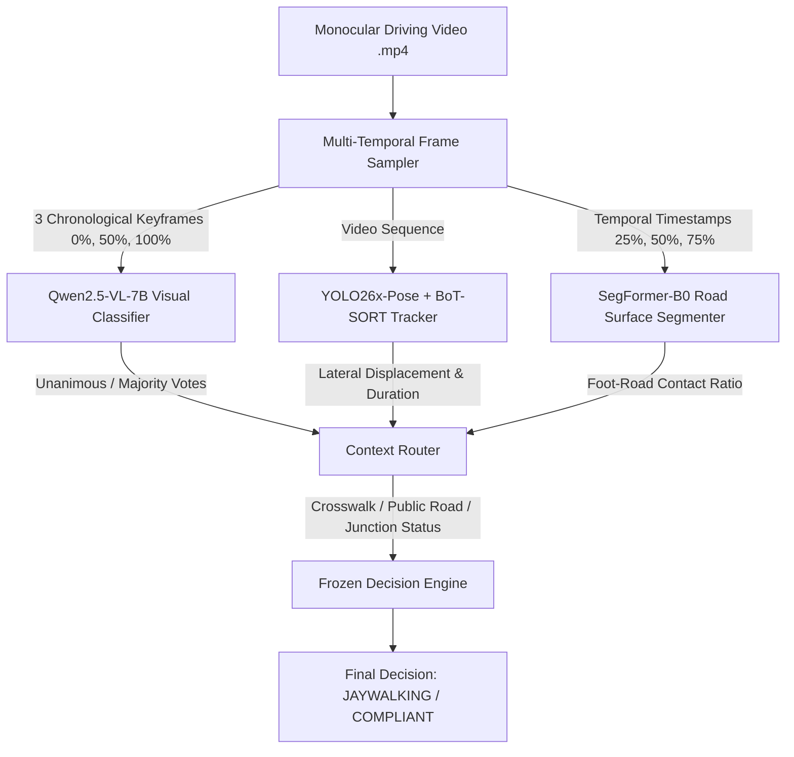

# Crowd Jaywalking Detection

[](https://opensource.org/licenses/MIT)
[](https://www.python.org/downloads/)
[](https://github.com/astral-sh/uv)
[](https://github.com/crowd-dataset/crowd-jaywalking/actions/workflows/linter.yml)

An end-to-end multimodal computer vision pipeline for detecting pedestrian jaywalking in real-world urban monocular driving video sequences.

The final production system combines:
- **Temporal visual reasoning** across multi-frame video intervals
- **Qwen2.5-VL-7B** for zero-shot semantic visual classification and wide-scene context verification
- **YOLO26x-Pose** and **BoT-SORT** for pedestrian pose tracking and kinematic trajectory extraction
- **SegFormer-B0** (Cityscapes) for multi-temporal road surface semantic segmentation
- **Wide-scene context verification** for crosswalk presence, public vs. private roadway distinction, and junction legality
- **Frozen rule-based multimodal decision synthesis** (Exp 57 Refined Context Synergy Architecture)

---

## 1. Final Benchmark Results

All development was performed exclusively on a 69-video development set. The 30-video locked test set was evaluated strictly once after freezing the architecture, without post-hoc tuning.

| Benchmark | Videos | Accuracy | Precision | Recall | Specificity | F1 Score |
|---|---:|---:|---:|---:|---:|---:|
| **Development Set (Exp 57)** | 69 | 92.75% | 83.33% | 100.00% | 88.64% | 90.91% |
| **Locked Unseen Test Set (Exp 58)** | 30 | **83.33%** | 75.00% | 81.82% | 84.21% | 78.26% |

> **Final reported generalization performance: 83.33% accuracy on the completely unseen 30-video locked test set.**

*Note:* The development set was used for iterative refinement and threshold calibration. The locked test set serves as the independent, unbiased evaluation of generalization capability.

---

## 2. System Architecture


```mermaid
flowchart TD
    A[Monocular Driving Video .mp4] --> B[Multi-Temporal Frame Sampler]
    
    B -->|3 Chronological Keyframes 0%, 50%, 100%| C[Qwen2.5-VL-7B Visual Classifier]
    B -->|Video Sequence| D[YOLO26x-Pose + BoT-SORT Tracker]
    B -->|Temporal Timestamps 25%, 50%, 75%| E[SegFormer-B0 Road Surface Segmenter]
    
    C -->|Unanimous / Majority Votes| F[Context Router]
    D -->|Lateral Displacement & Duration| F
    E -->|Foot-Road Contact Ratio| F
    
    F -->|Crosswalk / Public Road / Junction Status| G[Frozen Decision Engine]
    
    G --> H[Final Decision: JAYWALKING / COMPLIANT]
```

---

## 3. How the Pipeline Works

1. **Step 1 — Video Input:** The pipeline receives an input monocular driving video clip (`.mp4`).
2. **Step 2 — Multi-Temporal Sampling:** [`FrameSampler`](src/pipeline/frame_sampler.py) extracts keyframes across the duration (0%, 50%, 100%) and intermediate timestamps (25%, 50%, 75%) to capture temporal evolution.
3. **Step 3 — VLM Classification:** [`VLMClassifier`](src/perception/vlm_classifier.py) queries `Qwen2.5-VL-7B` via Ollama on each keyframe independently to establish baseline consensus.
4. **Step 4 — Pedestrian Tracking:** [`PedestrianTracker`](src/perception/pedestrian_tracking.py) executes YOLO26x-Pose detection with BoT-SORT to measure lateral displacement ($\Delta x$), bottom boundary position ($\bar{y}$), and track duration.
5. **Step 5 — Road Segmentation:** [`RoadSegmenter`](src/perception/road_segmentation.py) performs SegFormer-B0 semantic segmentation to calculate the pedestrian foot-road overlap ratio.
6. **Step 6 — Context Verification:** For candidate crossings, [`ContextRouter`](src/pipeline/context_router.py) queries specialized prompts evaluating marked crosswalks, public road vs. enclosed spaces, and intersection junction legality.
7. **Step 7 — Decision Engine:** [`DecisionEngine`](src/pipeline/decision_engine.py) synthesizes visual votes, kinematics, segmentation overlap, and contextual gating via frozen production rules.
8. **Step 8 — Final Verdict:** The system outputs the binary classification (`JAYWALKING` or `COMPLIANT`), the specific decision reasoning path, vote breakdowns, and execution latency.

---

## 4. Repository Structure

```text
crowd-jaywalking/
├── src/
│   ├── pipeline/
│   │   ├── jaywalking_pipeline.py  # End-to-end perception and reasoning orchestrator
│   │   ├── context_router.py       # Wide visual context verification queries
│   │   ├── decision_engine.py      # Frozen Exp 57 production decision rules
│   │   └── frame_sampler.py        # Multi-temporal keyframe and timestamp sampling
│   │
│   ├── perception/
│   │   ├── vlm_classifier.py       # Qwen2.5-VL-7B local Ollama client interface
│   │   ├── pedestrian_tracking.py  # YOLO26x-Pose + BoT-SORT trajectory tracker
│   │   └── road_segmentation.py    # SegFormer-B0 Cityscapes road segmenter
│   │
│   └── utils/
│       ├── metrics.py              # Binary classification metrics calculation
│       ├── plotting.py             # Plotly multi-format exporter (HTML, PNG, PDF, SVG)
│       └── video_utils.py          # Video decoding and base64 frame encoding
│
├── scripts/
│   ├── run_inference.py            # Single-video inference CLI
│   └── evaluate.py                 # Unified benchmark evaluation runner
│
├── tests/
│   ├── test_pipeline.py            # Unit tests for decision logic and metrics
│   └── test_plotting.py            # Unit tests for multi-format figure exporting
│
├── datasets/
│   └── manifests/                  # SHA-256 verified split CSV manifests
│
├── results/
│   ├── development/                # Exp 57 development metrics & transition records
│   └── locked_test/                # Exp 58 locked test metrics & confusion matrix
│
├── docs/
│   ├── ARCHITECTURE.md             # Detailed system design specification
│   ├── BENCHMARK_PROTOCOL.md       # Split definitions & evaluation protocols
│   └── PROJECT_REPORT.md           # Research methodology and evolution report
│
├── common.py                       # Configuration & secret loading utilities
├── custom_logger.py                # Standardized custom logger with brace formatting
├── logmod.py                       # Global logging handlers setup
├── default.config                  # Baseline project configuration template
├── default.secret                  # Safe template for API credentials
├── pyproject.toml                  # Modern uv project dependency specification
├── uv.lock                         # Deterministic dependency lockfile
└── README.md
```

- **`src/`**: Contains the active production implementation.
- **`scripts/`**: Contains only the necessary execution interfaces (`run_inference.py`, `evaluate.py`).
- **`results/`**: Contains verified benchmark summaries, per-video CSV records, and confusion matrices.
- **`docs/`**: Detailed technical reports, architecture specifications, and benchmark protocols.

---

## 5. Installation & Setup

The project uses [`uv`](https://github.com/astral-sh/uv) for deterministic Python environment and dependency management.

### 1. Install uv
```bash
curl -LsSf https://astral.sh/uv/install.sh | sh
```

### 2. Clone Repository & Synchronize Environment
```bash
git clone https://github.com/crowd-dataset/crowd-jaywalking.git
cd crowd-jaywalking

uv sync
```
*Note:* The project requires Python 3.10 as specified in `.python-version`.

### 3. Start Local VLM Service
Ensure Ollama is running with the target vision-language model:
```bash
ollama run qwen2.5vl:7b
```

---

## 6. Running Inference

Run inference on a single video clip:

```bash
uv run python scripts/run_inference.py --video path/to/video.mp4
```

To export the detailed prediction dictionary to a JSON file:
```bash
uv run python scripts/run_inference.py --video path/to/video.mp4 --output results/prediction.json
```

---

## 7. Running Benchmark Evaluation

Run evaluation using the unified benchmark evaluator:

```bash
# Evaluate on the Development 69-video benchmark (Exp 57)
uv run python scripts/evaluate.py --split development

# Evaluate on the Locked 30-video test benchmark (Exp 58)
uv run python scripts/evaluate.py --split locked_test

# Evaluate on a custom manifest
uv run python scripts/evaluate.py --manifest path/to/manifest.csv --video-dir path/to/videos --output-dir results/custom
```

> **Protocol Reminder:** The locked test set (`--split locked_test`) must be treated as an unseen evaluation benchmark and should not be used for post-hoc threshold tuning or rule adjustments.

---

## 8. Reproducibility & Research Integrity

- **Split Separation:** Development (69 videos) and Locked Test (30 videos) partitions are strictly segregated.
- **Integrity Verification:** Dataset manifests are tracked and verified with SHA-256 checksums (`locked_test_manifest.csv`: `0ba8541a9ba09dfaa03fa130064be2bc5d7024a6b7f4dc9bbb8e38ee4ae07269`).
- **Frozen Architecture:** The Exp 57 pipeline was fully frozen prior to executing the single Exp 58 test benchmark evaluation.
- **Minimal Production Codebase:** Obsolete prototype scripts have been removed to ensure the repository remains minimal, auditable, and maintainable.

---

## 9. Code Quality & Standards

The codebase adheres to strict software engineering standards:
- **Dependency Locking:** Managed deterministically via `pyproject.toml` and `uv.lock`.
- **Automated Testing:** Run test suites via `uv run pytest tests/`.
- **PEP 8 Compliance:** Enforced with Flake8 at a 119-character limit (`uv run flake8 --config=.github/linters/.flake8 .`).
- **YAML Validation:** Verified via Yamllint (`uv run yamllint -c .github/linters/.yamllint .github/ configs/`).
- **Continuous Integration:** GitHub Actions Super-Linter Slim v5 verifies code quality on all pushes and pull requests.
- **Standardized Logging & Config:** Managed via `custom_logger.py`, `logmod.py`, `common.py`, `default.config`, and `default.secret`.

---

## 10. Data & Model Files Policy

To keep the repository clean and lightweight:
- Raw `.mp4`, `.avi`, `.mov` video files are excluded from Git version control via `.gitignore`.
- Binary model weights (`.pt`, `.safetensors`, `.bin`) and runtime output caches (`outputs/`, `_logs/`, `_cache/`) are excluded.
- Place video datasets in `videos/` or `jaad_pedestrian_100/videos/` as described in dataset manifests.
