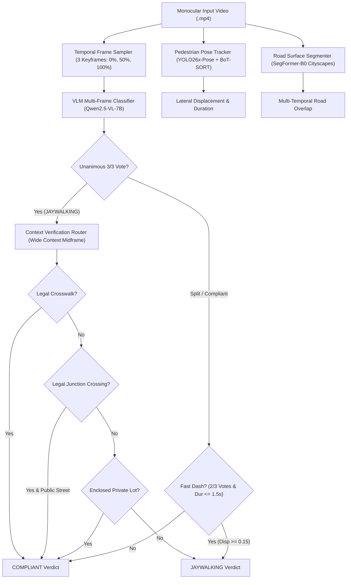

# Production System Architecture: Refined Context Synergy Architecture

---

## 1. Executive System Overview

The **Refined Context Synergy Architecture** is an end-to-end computer vision and multimodal reasoning pipeline designed for high-accuracy jaywalking detection from egocentric dashboard cameras. It synergizes:
1. **Kinematic Object Tracking:** Pedestrian localization and lateral displacement measurement using YOLO26x-Pose and BoT-SORT.
2. **Dense Road Semantic Segmentation:** Drivable roadway area extraction via SegFormer-B0.
3. **Temporal Visual-Language Reasoning:** High-precision multi-frame consensus using Qwen2.5-VL-7B.
4. **Context-Aware Visual Routers:** Wide-scene verification to resolve crosswalk striping, residential through-streets, private parking garages, and signalized intersection corners.

---

## 2. Component Specifications

### 2.1 Temporal Frame Sampling ([`src/pipeline/frame_sampler.py`](src/pipeline/frame_sampler.py))
- **Keyframe Strategy:** Samples 3 equidistant frames at timestamps $[0.0, 0.50, 1.00] \times T_{\text{duration}}$.
- **Temporal Verification Fractions:** Samples additional frames at $[0.25, 0.50, 0.75] \times T_{\text{duration}}$ for multi-temporal road surface validation.

### 2.2 Pedestrian Pose Tracking ([`src/perception/pedestrian_tracking.py`](src/perception/pedestrian_tracking.py))
- **Detector / Tracker:** YOLO26x-Pose with BoT-SORT tracker (`conf=0.25, iou=0.50`).
- **Feature Extraction:** Extracts normalized lateral displacement $\Delta x = |x_{\text{end}} - x_{\text{start}}|$, bottom keypoint anchor $\bar{y}_{\text{foot}}$, and continuous track duration $T_{\text{track}}$.

### 2.3 Semantic Road Segmentation ([`src/perception/road_segmentation.py`](src/perception/road_segmentation.py))
- **Model:** SegFormer-B0 fine-tuned on Cityscapes (Class 0: Road).
- **Foot-Road Contact Overlap:** Evaluates circular kernel overlap ($r=24\text{ px}$) around the pedestrian's ground contact coordinates across multiple temporal phases.

### 2.4 Multimodal Context Routers ([`src/pipeline/context_router.py`](src/pipeline/context_router.py))
When candidate crossings are detected, the context router queries three specialized visual verifiers on the wide uncropped scene:
1. **Crosswalk & Zebra Verifier:** Inspects for white painted zebra stripes, pedestrian signage, and crosswalk zones.
2. **Public Roadway Structure Verifier:** Distinguishes public through-streets (including residential roads) from indoor parking garages and private driveway aprons.
3. **Intersection Junction Verifier:** Identifies legal corner crossings and intersection yielding zones where paint may be snow-covered or worn.

### 2.5 Production Decision Engine ([`src/pipeline/decision_engine.py`](src/pipeline/decision_engine.py))
Synthesizes all multimodal signals into a deterministic binary classification with structured decision path logging.
